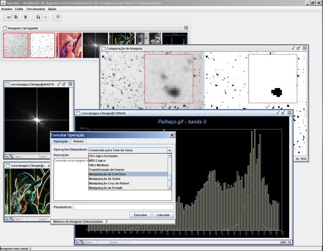

Narciso (Ambiente de Suporte ao Processamento de Imagens para Visão Computacional)
=======

Sistema de processamento de imagens para auxílio no estudo de métodos de visão computacional criado em coautoria com Kiran Mantripragada para a disciplina Visão Computacional no mestrado em Engenharia de Computação do Instituto de Pesquisas Tecnológicas do Estado de São Paulo.

Por favor, leia o documento [Guia de Utilização](docs/guia_de_utilizacao.pdf) para mais detalhes sobre o sistema.

---

Image processing system cocreated with Kiran Mantripragada to help in studing computer vision methods during the execution of the Computer Vision discipline in the master in Computer Engineering at the Instituto de Pesquisas Tecnológicas do Estado de São Paulo.

Please refer to the document [Guia de Utilização](docs/guia_de_utilizacao.pdf) (portuguese only) for further details on this system.
